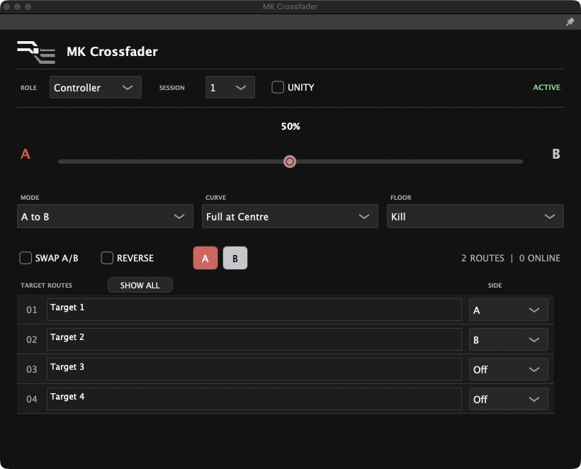
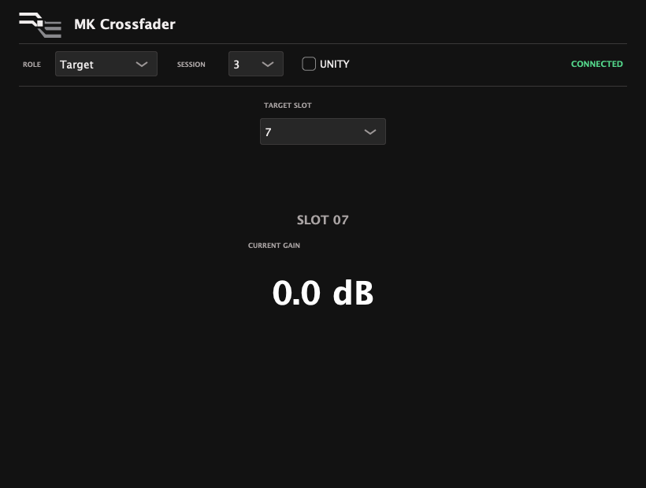

# MK Crossfader

<p align="center">
  
</p>

Created by [Mike Konstantinidis](https://konstantinidis.net/) while building his
own Maschine-based live set, and released as an open-source project for the
community.

> **Binary releases:** Developer ID signed and Apple-notarised installers are
> distributed only through the
> [Releases page](https://github.com/mks-devx/MK-Crossfader/releases). No
> unsigned public binaries are distributed from this repository.

MK Crossfader is an open-source macOS toolkit for multi-parameter MIDI
control and linked audio crossfading. It is designed and tested with Maschine 3
and supported Maschine hardware in Controller mode, while remaining compatible
with any MIDI controller that sends a standard, assignable MIDI CC:

- **MK MIDI Crossfader** is a native macOS app with a persistent menu-bar
  control that maps one physical MIDI control to multiple MIDI CC targets. It
  can control levels, filters, sends, effects, or other parameters exposed to
  MIDI Learn by the destination software.
- **MK Crossfader VST3** is a dedicated audio crossfader for Maschine 3,
  Ableton Live, and other compatible macOS VST3 hosts. It links one Controller
  instance to Target instances without changing the host's mixer faders.

> **Ableton Live multi-control:** the native app can turn one physical MIDI
> fader or knob into a coordinated macro for several Live parameters. Each
> mapped parameter can have its own direction, range, response shape, and
> Return Value. Max for Live is not required.

The native app is broader than a conventional crossfader. It can create
coordinated performance transitions or work as a custom sound-design macro:
one MIDI fader or knob can move multiple learned parameters together, while
each target keeps its own direction, range, response shape, and Return Value.
The VST3 intentionally stays focused on gain transitions and has also been
manually verified in Ableton Live.

Because the native app uses standard CoreMIDI, it can also work with other
macOS software that enables the virtual **MK Crossfader** input and learns
incoming MIDI CC messages. Use full-range **Parameter** targets for this. The
**Level** target is specifically calibrated for Maschine's mixer range. The
native app has also been manually verified with Ableton Live 12.4.5 on macOS.
Compatibility with other software depends on its MIDI Learn implementation.

The products are completely independent and can be used separately. The VST3
does not require the app to be installed or running, and the app does not
require, configure, or communicate with the VST3.

Public installers contain both products, the licence, third-party notices, and
the setup guide. The app and VST3 remain independent after installation.
Source maintainers can also create a separate ad-hoc signed local-test package.

## Ableton Live Multi-Control

The native app receives one MIDI CC from the hardware controller and sends a
separate CC for every configured target through its virtual **MK Crossfader**
MIDI input. Ableton Live can map those outputs to different parameters.

For example, moving one physical fader can simultaneously:

- open an Auto Filter through a restricted range;
- increase a reverb send;
- reduce delay feedback in the opposite direction; and
- trim Utility Gain to keep the transition controlled.

Use **Parameter** targets in **Range** mode, then set each target's Left, Right,
Shape, and Return Value independently. This works well for performance
transitions, effect builds, and repeatable sound-design movements without
creating a Max for Live device.

Ableton stores the MIDI mappings inside the Live Set. The app does not inspect
the Set or read parameter values back from Live, so Return Value is a value you
configure rather than the parameter's previously stored value.

See the [Ableton Live setup guide](docs/ABLETON_SETUP.md) for the complete
example and routing steps.

## App Preview

<p align="center">
  
</p>

## VST3 Preview

<p align="center">
  <strong>Controller</strong><br>
  
</p>

<p align="center">
  <strong>Target</strong><br>
  
</p>

## Choose A Workflow

| Need | MIDI app | VST3 |
| --- | --- | --- |
| Crossfade without inserting a plug-in on every target | Yes | No |
| Keep Maschine mixer faders untouched | No | Yes |
| Control filters, sends, or other learned parameters | Yes | No |
| Control several Ableton parameters from one hardware fader | Yes | No |
| Crossfade several Ableton audio tracks without moving mixer faders | No | Yes |
| Requires the other MK Crossfader product | No | No |
| Exact plug-in unity at 0.0 dB | No | Yes |

Use one workflow per crossfader system. Combining them is possible, but only
makes sense when each has a separate job.

## Quick Start

For the independent VST3:

1. Add one MK Crossfader instance to Master and set it to **Controller**.
2. Map its Crossfader parameter to your physical fader through Maschine.
3. Add a **Target** instance after the effects on every Group or Sound you want
   to control.
4. Give each Target a unique slot in the same session.
5. Assign those routes to A, B, or Off in the Controller.

The same VST3 structure works in Ableton Live: place the Controller on Master,
place Targets after the audio source or effects on the tracks you want to fade,
and keep every instance in the same session with a unique Target slot.

Each Target is an audio effect and only changes audio that passes through that
instance. It works with samples, loops, software instruments, and live audio;
it does not process MIDI or create sound on an empty channel. The Master
Controller sends crossfader control data but does not fade the Master output.

For the MIDI app with Maschine:

1. Start MK MIDI Crossfader before Maschine.
2. Enable its virtual **MK Crossfader** MIDI input in Maschine.
3. Add a target, put the matching Maschine parameter into MIDI Learn, and press
   **Send Learn**.
4. Assign the target to A, B, Range, or Off.

For the MIDI app with Ableton Live or other MIDI Learn software:

1. Start MK MIDI Crossfader and select the physical MIDI controller.
2. Enable the virtual **MK Crossfader** input for MIDI mapping in the
   destination software.
3. Add a **Parameter** target, activate MIDI Learn on the destination
   parameter, and press **Send Learn**.
4. Repeat for additional parameters, then assign each target to A, B, Range, or
   Off.

In Ableton Live, enable **Remote** for the **MK Crossfader** input under
**Settings > Link, Tempo & MIDI**, then use Live's MIDI Map mode for each
destination. The complete process is documented in the
[Ableton Live setup guide](docs/ABLETON_SETUP.md).

The destination must expose the parameter to MIDI Learn. The app does not scan
other software, control arbitrary plug-in parameters directly, or rewrite host
routing.

The app appears in both the Dock and menu bar by default. Disable **Show in
Dock** under **Advanced** to keep it available only from the menu bar. Enable
**Launch at Login** there to start it automatically when signing in to macOS.

See [Maschine setup](docs/MASCHINE_SETUP.md) for the complete routing and
recovery workflow.

## Requirements

- macOS 14 or later for MK MIDI Crossfader
- macOS 13 or later and a VST3 host for MK Crossfader VST3
- A destination that accepts virtual CoreMIDI input and MIDI Learn for general
  native-app use
- Maschine 3 desktop software for the documented VST3 workflow and the
  Maschine-calibrated Level target
- Xcode command-line tools and CMake 3.22 or later to build from source

These tools run on the Mac. Maschine+ can be used in **Controller mode** with
Maschine 3 running on the Mac, but neither tool can be loaded or run inside
Maschine+ in standalone mode.

The native app can receive an assignable MIDI CC from any controller visible to
macOS. This does not add Maschine 3 integration for legacy hardware that Native
Instruments does not support, including Maschine/Maschine Mikro MK1 and MK2.

## Build And Test

```zsh
./scripts/verify-all.sh
```

The script builds and tests both products without installing them. JUCE 8.0.15
is fetched automatically for the VST3 unless `JUCE_SOURCE_DIR` points to an
existing checkout.

See [Building](docs/BUILDING.md) and [Installation](docs/INSTALLATION.md) for
individual commands and output locations.

## Live Use

Treat this as performance software, not a replacement for a recoverable mix
state. Test the exact project, controller, USB path, and host version before a
show. Keep a manual unity or neutral recovery control available. A crash, forced
termination, or power loss cannot restore the last MIDI-controlled value.

More detail is available in [Architecture](docs/ARCHITECTURE.md) and
[Privacy](docs/PRIVACY.md).

## Support And Updates

Setup help and bug reports are handled publicly through GitHub so that answers
remain searchable and useful to everyone. Please do not contact Mike through
Instagram, email, or other private channels for setup instructions,
troubleshooting, or individual bug fixes.

Support is provided on a best-effort basis. Check the GitHub repository and its
Releases page for updates, or use the macOS app's manual **Check for Updates**
command. It never checks, downloads, or installs in the background; the VST3
remains completely offline. Read the complete [support policy](SUPPORT.md)
before reporting a problem.

## Contributing

Bug reports and focused pull requests are welcome. Read
[CONTRIBUTING.md](CONTRIBUTING.md) before submitting changes. Security issues
should follow [SECURITY.md](SECURITY.md).

## Licence

MK Crossfader is released under the
[GNU Affero General Public License v3.0](LICENSE). The VST3 uses JUCE 8.0.15
under JUCE's AGPLv3 option. See [third-party notices](THIRD_PARTY_NOTICES.md).

Product names are used only to describe compatibility and workflow. This
project is independent and is not affiliated with or endorsed by the
manufacturers mentioned in the documentation. See [TRADEMARKS.md](TRADEMARKS.md).
