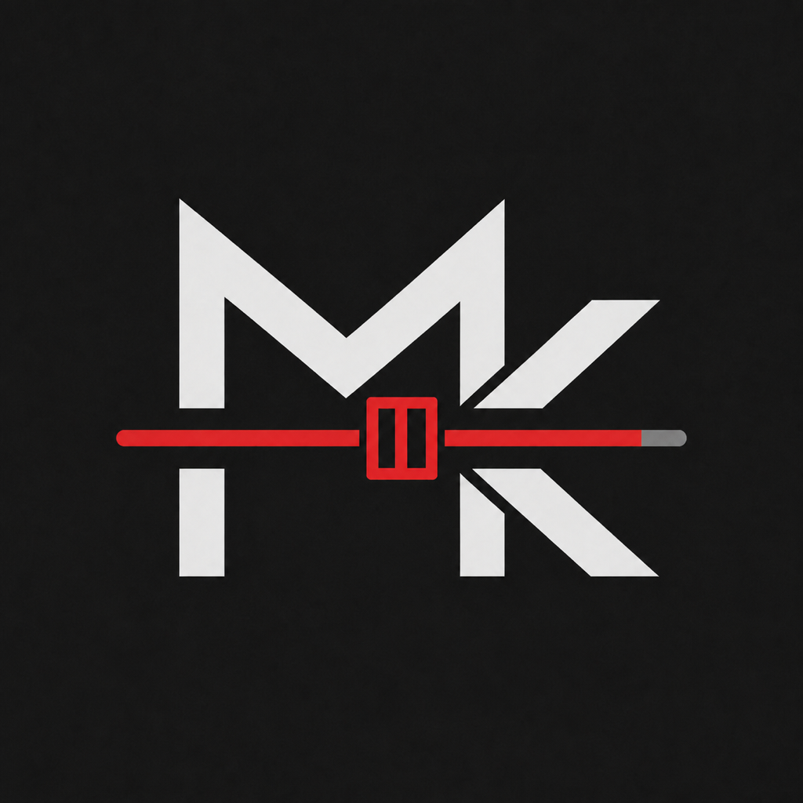
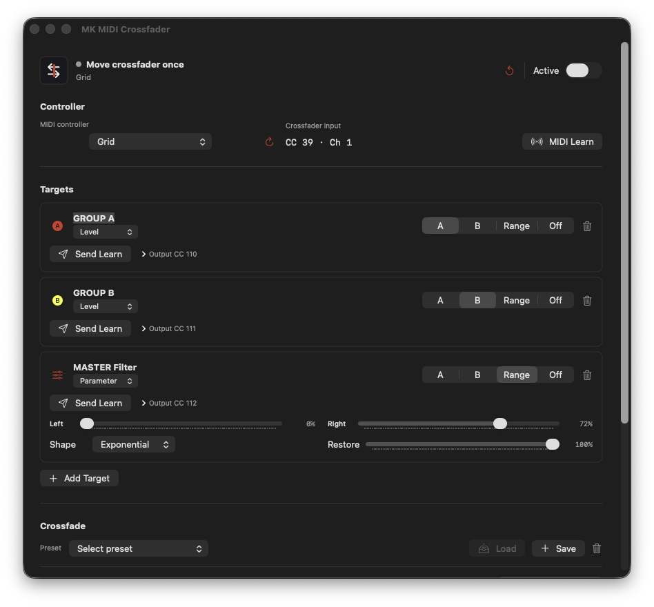

# MK Crossfader (Maschine Crossfader)

<p align="center">
  
</p>

Created by [Mike Konstantinidis](https://konstantinidis.net/) while building his
own Maschine-based live set, and released free for the community.

> **Early open-source preview:** the source is available now. Signed and
> notarised installers will follow after release testing. No unsigned public
> binaries are distributed from this repository.

MK Crossfader is a free, open-source pair of macOS performance tools for
Maschine 3:

- **MK MIDI Crossfader** is a native macOS app with a persistent menu-bar
  control that maps one physical MIDI control to multiple Maschine targets. It
  can control mixer levels, filters, sends, effects, or any other parameter
  available to Maschine MIDI Learn.
- **MK Crossfader VST3** is a dedicated audio crossfader that links one
  Controller instance to Target instances without changing Maschine's mixer
  faders.

The native app is broader than a conventional crossfader. It can create
coordinated performance transitions or work as a custom sound-design macro:
one MIDI fader or knob can move multiple learned parameters together, while
each target keeps its own direction, range, response shape, and restore value.
The VST3 intentionally stays focused on gain transitions.

The products are completely independent and can be used separately. The VST3
does not require the app to be installed or running, and the app does not
require, configure, or communicate with the VST3.

Either workflow can be driven by any MIDI controller that sends a standard,
assignable MIDI CC. No specific controller model is required.

The repository includes a local-test installer pipeline for maintainers. It is
not a public download and is not a substitute for Developer ID signing and
Apple notarisation.

## App Preview

<p align="center">
  
</p>

## Choose A Workflow

| Need | MIDI app | VST3 |
| --- | --- | --- |
| Crossfade without inserting a plug-in on every target | Yes | No |
| Keep Maschine mixer faders untouched | No | Yes |
| Control filters, sends, or other learned parameters | Yes | No |
| Requires the other MK Crossfader product | No | No |
| Exact plug-in unity at 0.0 dB | No | Yes |

Use one workflow per crossfader system. Combining them is possible, but only
makes sense when each has a separate job.

## Quick Start

For the independent VST3:

1. Add one MK Crossfader instance to Master and set it to **Controller**.
2. Map its Crossfader parameter to your physical fader through Maschine.
3. Add a **Target** instance after the effects on every Group or Sound you want
   to control.
4. Give each Target a unique slot in the same session.
5. Assign those routes to A, B, or Off in the Controller.

Each Target is an audio effect and only changes audio that passes through that
instance. It works with samples, loops, software instruments, and live audio;
it does not process MIDI or create sound on an empty channel. The Master
Controller sends crossfader control data but does not fade the Master output.

For the MIDI app:

1. Start MK MIDI Crossfader before Maschine.
2. Enable its virtual **MK Crossfader** MIDI input in Maschine.
3. Add a target, put the matching Maschine parameter into MIDI Learn, and press
   **Send Learn**.
4. Assign the target to A, B, Range, or Off.

The app appears in both the Dock and menu bar by default. Disable **Show in
Dock** under **Advanced** to keep it available only from the menu bar. Enable
**Launch at Login** there to start it automatically when signing in to macOS.

See [Maschine setup](docs/MASCHINE_SETUP.md) for the complete routing and
recovery workflow.

## Requirements

- macOS 14 or later for MK MIDI Crossfader
- macOS 13 or later and a VST3 host for MK Crossfader VST3
- Maschine 3 desktop software for the documented workflow
- Xcode command-line tools and CMake 3.22 or later to build from source

These tools run on the Mac. Maschine+ can be used in **Controller mode** with
Maschine 3 running on the Mac, but neither tool can be loaded or run inside
Maschine+ in standalone mode.

The native app can receive an assignable MIDI CC from any controller visible to
macOS. This does not add Maschine 3 integration for legacy hardware that Native
Instruments does not support, including Maschine/Maschine Mikro MK1 and MK2.

## Build And Test

```zsh
./scripts/verify-all.sh
```

The script builds and tests both products without installing them. JUCE 8.0.15
is fetched automatically for the VST3 unless `JUCE_SOURCE_DIR` points to an
existing checkout.

See [Building](docs/BUILDING.md) and [Installation](docs/INSTALLATION.md) for
individual commands and output locations.

## Live Use

Treat this as performance software, not a replacement for a recoverable mix
state. Test the exact project, controller, USB path, and host version before a
show. Keep a manual unity or neutral recovery control available. A crash, forced
termination, or power loss cannot restore the last MIDI-controlled value.

More detail is available in [Architecture](docs/ARCHITECTURE.md) and
[Privacy](docs/PRIVACY.md).

## Support And Updates

Setup help and bug reports are handled publicly through GitHub so that answers
remain searchable and useful to everyone. Please do not contact Mike through
Instagram, email, or other private channels for setup instructions,
troubleshooting, or individual bug fixes.

Support is provided on a best-effort basis. Check the GitHub repository and its
Releases page for updates, or use the macOS app's manual **Check for Updates**
command. It never checks, downloads, or installs in the background; the VST3
remains completely offline. Read the complete [support policy](SUPPORT.md)
before reporting a problem.

## Contributing

Bug reports and focused pull requests are welcome. Read
[CONTRIBUTING.md](CONTRIBUTING.md) before submitting changes. Security issues
should follow [SECURITY.md](SECURITY.md).

## Licence

MK Crossfader is released under the
[GNU Affero General Public License v3.0](LICENSE). The VST3 uses JUCE 8.0.15
under JUCE's AGPLv3 option. See [third-party notices](THIRD_PARTY_NOTICES.md).

Product names are used only to describe compatibility and workflow. This
project is independent and is not affiliated with or endorsed by the
manufacturers mentioned in the documentation. See [TRADEMARKS.md](TRADEMARKS.md).
